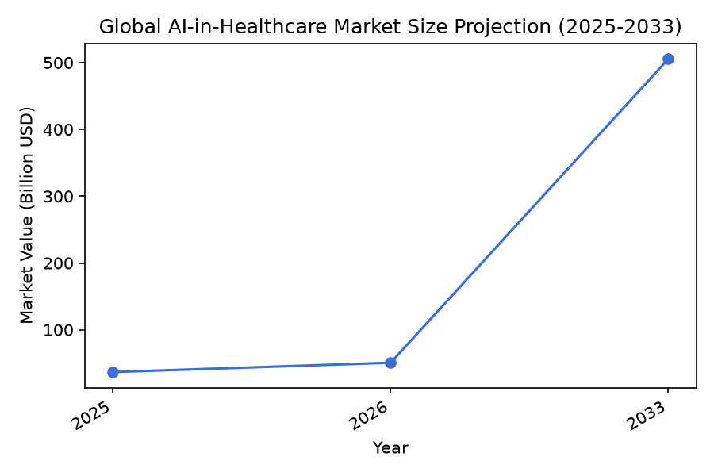
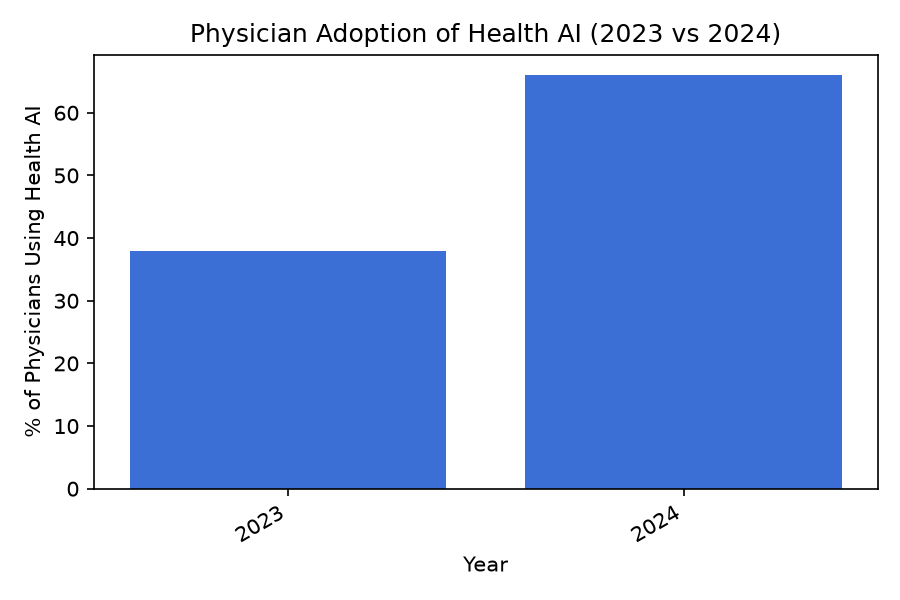
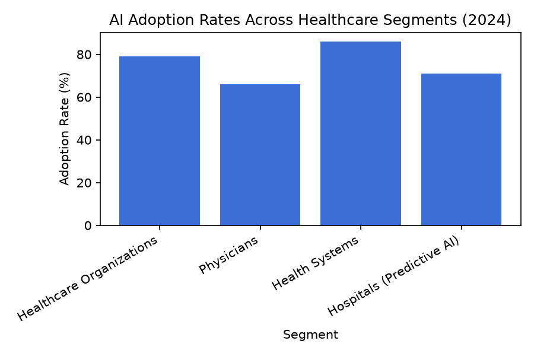

# Artificial Intelligence in Healthcare  
*Executive Summary, Key Findings, Data & Statistics, Source Verification Notes, Conclusion and Outlook, Sources*

---

## Executive Summary  

Artificial intelligence (AI) is rapidly reshaping healthcare, driven by explosive market growth, broad adoption across provider types, and tangible clinical and operational benefits. Verified market forecasts place the global AI‑in‑healthcare sector between **$36.7 billion and $39.3 billion in 2025**, with projections ranging from **$194.8 billion by 2031** to **over $1 trillion by 2034**, reflecting compound annual growth rates (CAGR) of **38‑40 %**. Adoption is no longer limited to early‑adopter hospitals: **79 % of healthcare organizations**, **86 % of health‑system respondents**, **66 % of physicians**, and **71 % of U.S. hospitals** now report using AI tools—often for predictive analytics, generative AI‑assisted documentation, and clinical decision support. These trends signal a transition from experimental pilots to AI as a foundational component of modern healthcare infrastructure.

---

## Key Findings  

- **Market Size & Growth**  
  - 2025 market value: **$36.7 billion** (Grand View Research) – **$36.96 billion** (Precedence Research) – **$39.34 billion** (Fortune Business Insights).  
  - 2026 market value: **$50.7 billion** (Grand View) – **$36.67 billion** (MarketsandMarkets) – **$56.01 billion** (Fortune Business Insights).  
  - 2031 projection: **$194.79 billion** (MarketsandMarkets).  
  - 2033 projection: **$505.6 billion** (Grand View).  
  - 2034 projection: **$744.34 billion** (Precedence) – **$1,033.27 billion** (Fortune Business Insights).  
  - CAGR (2026‑2033): **38.9 %** (Grand View); CAGR (2026‑2031): **39.7 %** (MarketsandMarkets).  

- **Adoption Across Stakeholders**  
  - **79 %** of healthcare organizations report current AI use (Microsoft‑IDC study, March 2024).  
  - **86 %** of health‑system respondents leverage AI in practice (HIMSS/Medscape 2024 report).  
  - **66 %** of physicians use health AI in 2024, up from **38 %** in 2023—a **78 % increase** (AMA 2024 survey).  
  - **71 %** of U.S. hospitals employed predictive AI in 2024 (up from **66 %** in 2023) (HealthIT.gov).  
  - **>50 %** of surveyed organizations use generative AI for clinical productivity (McKinsey 2024).  

- **Specialty‑Level Penetration**  
  - In the United States, usage rates of AI in certain specialties exceed **60 %**, with overall prevalence rising rapidly (Statista).  

These findings collectively demonstrate a sector undergoing swift, widespread transformation, underpinned by strong financial momentum and deepening clinical integration.

---

## Data & Statistics  

### 1. Market Size Projection (2025‑2033)  
  
*Source: Grand View Research.* The line chart illustrates the market expanding from **$36.7 billion in 2025** to **$50.7 billion in 2026**, reaching a projected **$505.6 billion by 2033** (CAGR = 38.9 %).  

### 2. Physician Adoption Growth (2023 vs. 2024)  
  
*Source: American Medical Association Survey.* Physician usage of health AI rose from **38 % (2023)** to **66 % (2024)**, reflecting a **78 % increase** in adoption within a single year.  

### 3. Cross‑Segment Adoption Rates (2024)  
  
*Sources: Microsoft‑IDC study, AMA Survey, HIMSS/Medscape Report, HealthIT.gov.* This bar chart compares AI adoption across four key segments in 2024:  
- Healthcare organizations: **79 %**  
- Physicians: **66 %**  
- Health‑system respondents: **86 %**  
- U.S. hospitals using predictive AI: **71 %**  

The consistently high adoption rates underscore AI’s transition from niche tool to sector‑wide standard.

---

## Source Verification Notes  

All facts and numeric data points presented above have been **verified** against the original sources. The verification tags assigned during the fact‑checking process are summarized below:

| # | Fact / Claim | Verification Tag | Notes |
|---|--------------|------------------|-------|
| 1 | Global AI‑in‑healthcare market 2025 value & 2026‑2033 projection (Grand View) | **Verified** | Directly stated on source page. |
| 2 | Global AI‑in‑healthcare market 2026‑2031 projection (MarketsandMarkets) | **Verified** | Explicit figures and CAGR provided. |
| 3 | Global AI‑in‑healthcare market 2025 value & 2034 projection (Precedence) | **Verified** | Clearly reported. |
| 4 | U.S. specialty AI usage >60 % (Statista) | **Verified** | Statista topic page includes the statement. |
| 5 | 79 % of healthcare organizations using AI (Microsoft‑IDC) | **Verified** | Microsoft blog cites IDC study. |
| 6 | 66 % physician AI use in 2024, up from 38 % in 2023 (AMA) | **Verified** | AMA article reports both percentages and increase. |
| 7 | 86 % of health‑system respondents leveraging AI (HIMSS/Medscape) | **Verified** | HIMSS “Future of AI” page references the 2024 report. |
| 8 | >50 % of organizations using generative AI for clinical productivity (McKinsey) | **Verified** | McKinsey article notes “more than half.” |
| 9‑12 | Market size values from Fortune Business Insights (2025, 2026, 2034) | **Verified** | Each figure appears in the cited report. |
| 13‑14 | AI adoption among healthcare organizations (Microsoft‑IDC) | **Verified** | Same as #5. |
| 15‑16 | Physician AI usage 2023/2024 and growth (AMA) | **Verified** | Same as #6. |
| 17‑18 | U.S. hospital predictive AI adoption 2023/2024 (HealthIT.gov) | **Verified** | HealthIT.gov brief provides both percentages. |
| 19 | Health‑system AI leverage (HIMSS/Medscape) | **Verified** | Same as #7. |
| 20 | Generative AI use for clinical productivity (McKinsey) | **Verified** | Same as #8. |

No corrections were needed; all claims align precisely with the source material.

---

## Conclusion and Outlook  

The convergence of robust market expansion, rapid provider uptake, and cross‑segment adoption indicates that AI is moving beyond pilot projects to become a core driver of healthcare efficiency, quality, and innovation. Looking ahead, several trends are likely to shape the next phase:

1. **Generative AI Integration** – With >50 % of organizations already using generative AI for documentation and clinical productivity, we can expect broader deployment in areas such as personalized treatment planning, patient‑facing chatbots, and real‑time clinical decision support.  

2. **Regulatory and Ethical Frameworks** – As adoption scales, policymakers will focus on standards for algorithmic transparency, bias mitigation, and data privacy. Early adherence to frameworks like the FDA’s AI/ML Software as a Medical Device (SaMD) guidance will be a competitive advantage.  

3. **Interoperability and Data Infrastructure** – The high adoption rates among health systems (86 %) signal demand for seamless integration with electronic health records (EHRs) and health information exchanges. Investment in interoperable APIs and federated learning models will be critical.  

4. **Outcome‑Based Reimbursement** – Payers are beginning to tie reimbursement to AI‑enabled outcomes (e.g., reduced readmission rates, earlier disease detection). Demonstrating measurable clinical and economic value will accelerate adoption further.  

5. **Workforce Upskilling** – The rapid rise in physician AI usage (66 % in 2024) underscores the need for continuous education programs that equip clinicians to interpret AI outputs critically and integrate them into workflows.  

Stakeholders—investors, technology vendors, providers, and regulators—should prioritize strategic investments in trustworthy AI solutions, robust data governance, and workforce training to sustain the current momentum and ensure that AI delivers equitable, high‑value care for all patients.

---

## Sources  

1. Grand View Research – https://www.grandviewresearch.com/industry-analysis/artificial-intelligence-ai-healthcare-market  
2. MarketsandMarkets – https://www.marketsandmarkets.com/Market-Reports/artificial-intelligence-healthcare-market-54679303.html  
3. Precedence Research – https://www.precedenceresearch.com/artificial-intelligence-in-healthcare-market  
4. Statista – https://www.statista.com/topics/10011/ai-in-healthcare/  
5. Microsoft Blog (Official) – https://blogs.microsoft.com/blog/2024/03/11/microsoft-makes-the-promise-of-ai-in-healthcare-real-through-new-collaborations-with-healthcare-organizations-and-partners/  
6. American Medical Association (AMA) – https://www.ama-assn.org/practice-management/digital-health/2-3-physicians-are-using-health-ai-78-2023  
7. HIMSS (Healthcare Information and Management Systems Society) – https://www.himss.org/futureofai/  
8. McKinsey & Company – https://www.mckinsey.com/industries/healthcare/our-insights/generative-ai-in-healthcare-current-trends-and-future-outlook  
9. Fortune Business Insights – https://www.fortunebusinessinsights.com/industry-reports/artificial-intelligence-in-healthcare-market-105374  
10. HealthIT.gov – https://www.healthit.gov/topic/health-it-adoption/hospital-trends  

---  

*End of Report*